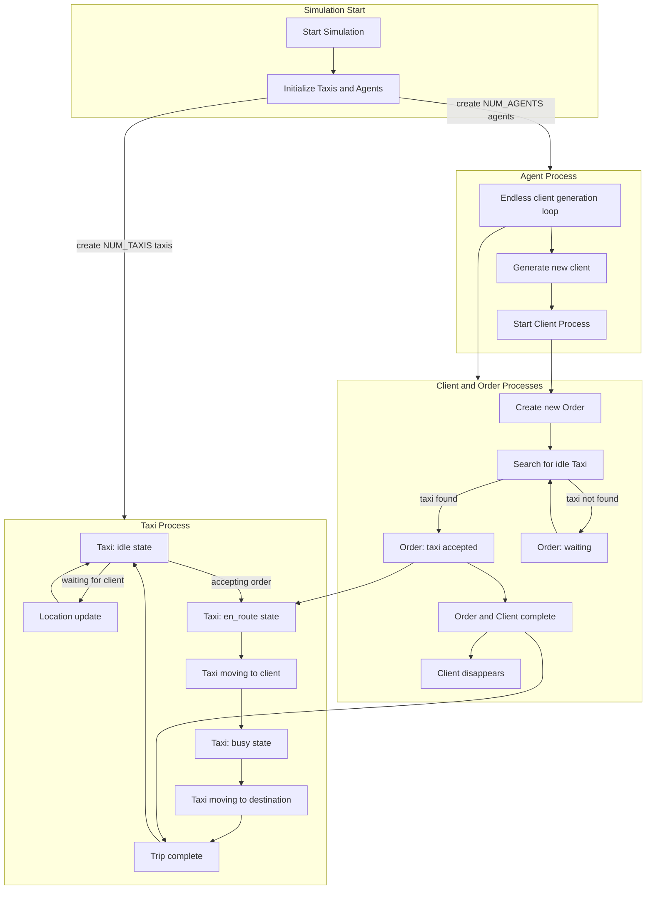

# Taxi service simulator
## set the env

```bash
julia --project=jenv
```
```julia
]instantiate
```

## edit the config file (if you like) `config.toml`

## run

```julia
include("main.jl")
```

# Description of the taxi service simulator

## Taxi

There are always $N$ taxis on the map. They change their `state` depending on receiving an order.

* `state = 'idle'`

  * NOW: moves in random steps from the last order point (or the starting point of the workday &mdash; $t_{simulation} = 0$).

  * TODO: moves according to the *two-dimensional random walk* model (needs many steps to really go far). Or [*Wiener process*](https://en.wikipedia.org/wiki/Random_walk).

* `state = 'en_route'`

  * NOW: Moves to the client in a straight trajectory.

  * TODO: consider complex movement with a function reducing the vector to the client.

* `state = 'busy'`

  * NOW: Moves in a straight trajectory to `dropoff_location`.

  * TODO: Complex movement to the point.

* `state = 'done'`

  * NOW: The order is completed. Waiting for approval from the **Order** process. (that is, actually, to return it to the `'idle'` state)

## Agent

**Agent** &mdash; <u>intentionally</u> complicated order generation process. This is an asynchronous process that creates a *Client* process every $t \sim P(\lambda)$. And this is in `while true...`

Agents are needed for a more realistic appearance of orders on the map. Specifically from the perspective of `timestamp`.

***That is, the number of Clients is actually limited only by `SIM_TIME`.***

## Client

NOW: A process that generates the *Order* process and that's it.

TODO: Complete the implementation of order cancellation by the client with some probability. Such cancellation will only work while the taxi is in `state = 'en_route'`, that is, on the way to the client.

## Order

The process of handling an order from the client.

What it does:

1. finds a taxi in the taxi with `state = 'idle'`.

2. **(!)** changes the taxi's state `state` in the following sequence:

`'idle'` → `'en_route'` → `'busy'` → **(waits until the taxi's state becomes `'done'`)** → `'idle'`.

As soon as the taxi reaches the `'idle'` state, the process **ends**.

**END.**

All this depends on the location of the taxi driver, their actions (see above in [Taxi](#taxi))

# Diagram

Approximate principle of operation


