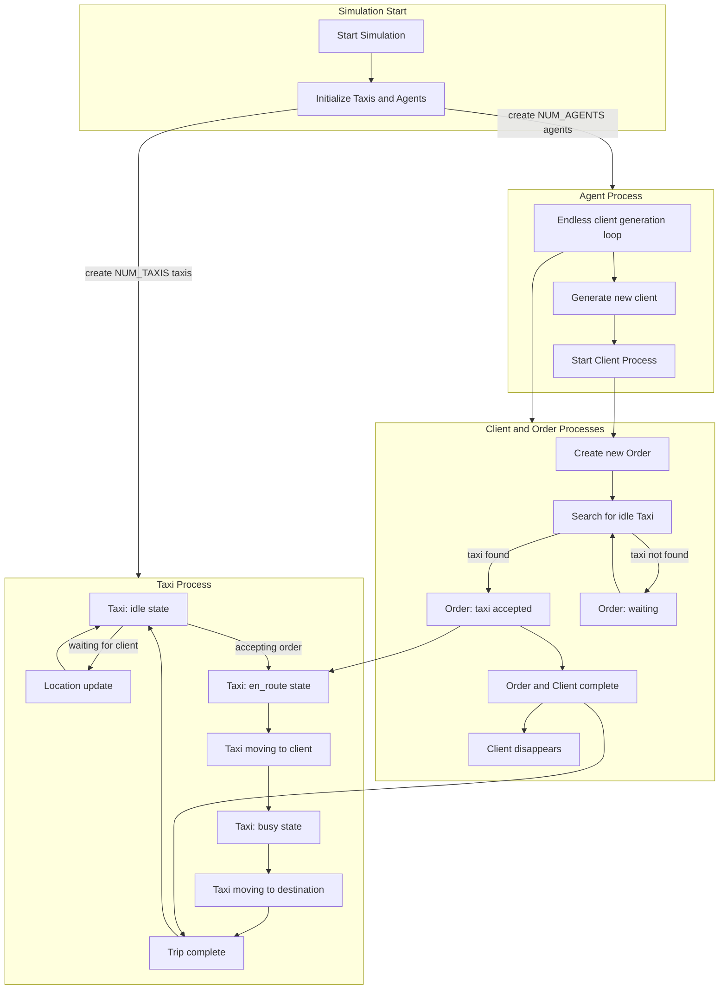

# Taxi service simulator
## set the env

```bash
julia --project=jenv
```
```julia
]instantiate
```

## edit the config file (if you like) `config.toml`

## run

```julia
include("main.jl")
```

# Описание симулятора сервиса такси 

## Taxi

На карте всегда $N$ такси. Они меняют свой `state` в зависимости от получения
заказа.

* `state = 'idle'`

  * NOW: движется по случайным шагам от точки последнего заказа
    (либо точки начала рабочего дня &mdash; $t_{simulation} = 0$).

  * TODO: движется по модели *двумерного случайного блуждания* (надо много
    шагов, что реально далеко ушел). Либо [*винеровский
    процесс*](https://en.wikipedia.org/wiki/Random_walk).

* `state = 'en_route'`

  * NOW: Движется к клиенту по прямой тракетории.  

  * TODO: подумать про сложное движение с функцией уменьшения вектора до
    клиента.

* `state = 'busy'`
  
  * NOW: Движется по прямой траектории к `dropoff_location`

  * TODO: Сложное движение до точки.

* `state = 'done'`

  * NOW: Заказ выполнен. Ждет аппрува от процесса **Order**. (то есть
    фактически, чтобы его вернули в состояние `'idle'`)
 
## Agent

**Agent** &mdash; <u>намеренно</u> усложненный процесс генерации заказов. Это асинхронный
процесс, который раз в $t \sim P(\lambda)$ создает процесс *Client*. И это в `while true...`

Агенты нужны для более реалистичного появления заказов на карте. Именно с
точки зрения `timestamp`.

***То есть количество Client фактически ничем, кроме `SIM_TIME` не ограничено.***

## Client

NOW: Процесс, который порождает процесс *Order* и все.

TODO: Доделать реализацию отмены заказа от клиента с некоторой вероятностью.
Такая отмена будет работать только пока такси находится в `state = 'en_route'`,
то есть едет к клиенту.

## Order

Процесс обработки заказа от клиента.

Что делает:

1. находит такси в такси со `state = 'idle'`.

2. **(!)** меняет состояние такси `state` в следующей последовательности:

`'idle'` → `'en_route'` → `'busy'` → **(waits until the taxi's state becomes `'done'`)** → `'idle'`.  

Как только такси достигает состояния `'idle'`, процесс **завершается**.

**END.**

Все это в зависимости от местоположения таксиста, его действий (см. выше в
[Taxi](#taxi))

# Diagram

Примерный принцип работы


